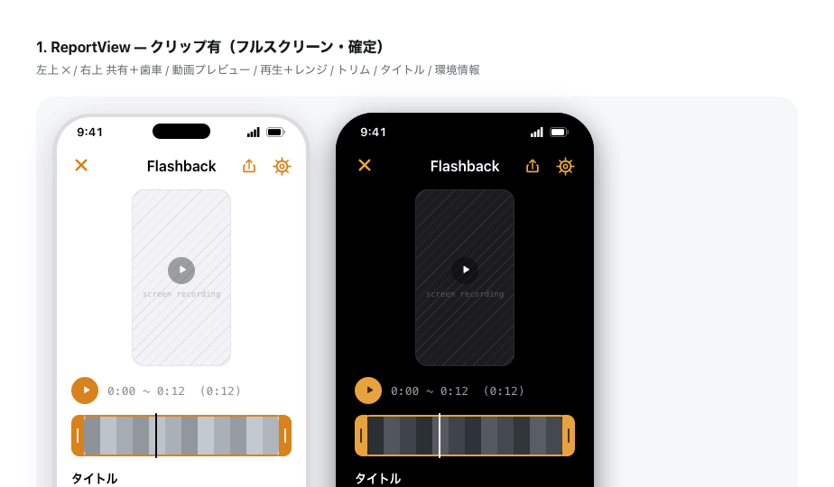

<p align="center">
  <picture>
    <source media="(prefers-color-scheme: dark)" srcset="docs/flashbackkit-logo-dark.png">
    
  </picture>
</p>

<p align="center"><em>Recall the moment <strong>before</strong> the bug.</em></p>

<p align="center">
  
  
  
  
  
</p>

---

A zero-dependency iOS SDK that captures the **context right before a bug happens** — the
last N seconds of screen recording, a one-line note, and full device info — and hands it
off to your pipeline (AI summarizer, Slack, Jira, your own backend) in one callback.

Testers always notice the bug *after* it happens. By then the steps that led there are
gone. FlashbackKit keeps a rolling buffer of the screen, so when a tester files a report,
the seconds **leading up to the bug** are already captured — sparing you the "can you
reproduce it?" round-trips.

> [!NOTE]
> **Status: PoC / WIP.** Built for Debug / Staging / TestFlight / internal QA builds —
> not for shipping to end users. The design bias is making testers *want* to use it and
> improving reproducibility, over architectural purity. The public API may change before
> a 1.0 release.

<details>
<summary>UI preview (design mockups)</summary>

<br>



</details>

## Contents

- [Highlights](#highlights)
- [How it works](#how-it-works)
- [Requirements](#requirements)
- [Installation](#installation)
- [Quick Start](#quick-start)
- [Localization](#localization)
- [Configuration](#configuration)
- [The `onReport` handoff](#the-onreport-handoff)
- [Triggers](#triggers)
- [Privacy & masking sensitive data](#privacy--masking-sensitive-data)
- [Security](#security)
- [Known constraints](#known-constraints)
- [Example app](#example-app)
- [Debug helpers](#debug-helpers)
- [Tests](#tests)
- [Roadmap](#roadmap)
- [Contributing](#contributing)
- [License](#license)

## Highlights

- **The "before" is already recorded** — an always-on ReplayKit ring buffer means the last
  N seconds are *already captured* when a report is triggered. ReplayKit can't rewind, so
  this is the only way to get the pre-bug context.
- **Zero dependencies** — just UIKit / SwiftUI / ReplayKit from the system SDK. No
  Firebase, Alamofire, or Rx, and no network client of its own. Drops into any app and
  keeps your dependency graph clean.
- **Two triggers, your choice** — shake the device twice, or a draggable floating button
  for fixed/kiosk devices. Pick either or both.
- **Trim before you send** — testers preview the clip and trim to the relevant moment in a
  built-in editor; the title and device info are baked into the exported file.
- **One handoff point** — a single `onReport` callback gives you the trimmed clip, the
  title, and device info. Route it anywhere. *The SDK's job ends at "here's the report."*
- **Unfiltered by design — except passwords** — the clip records everything the app
  renders, and masking is the host app's responsibility (see
  [Privacy](#privacy--masking-sensitive-data)). The one built-in guard: capture **pauses
  automatically while a secure text field is being edited**, so passwords stay out of the
  clip.

## How it works

```
 trigger (shake twice / floating button)
        │
        ▼
 export the last N seconds from the ring buffer
        │
        ▼
 Report UI  ──►  preview + trim  +  one-line title  +  auto device info
        │
        ▼
 Share (↑)  ──►  trims, bakes metadata, opens the system share sheet
        │         (save to Photos / Files / AirDrop / other apps)
        ▼
 onReport(FlashbackReport)  ──►  your pipeline (AI / Slack / Jira / backend)
```

## Requirements

| | |
|---|---|
| Platform | iOS 16+ |
| Toolchain | Swift 6 / Xcode 16+ |
| Dependencies | none |

## Installation

> [!NOTE]
> Latest release: **`0.12.0`** — pre-1.0, so the public API may change before a stable
> 1.0. Pin an exact version if you need stability.

### Swift Package Manager (Xcode)

**File → Add Package Dependencies…** and enter:

```
https://github.com/kensuke242424/flashbackkit-ios.git
```

Set **Dependency Rule = Up to Next Major Version** from `0.12.0` (or pin **Exact** `0.12.0`
while the API is pre-1.0).

### Package.swift

```swift
.package(url: "https://github.com/kensuke242424/flashbackkit-ios.git", from: "0.12.0")
```

```swift
.target(name: "YourApp", dependencies: ["FlashbackKit"])
```

## Quick Start

Call `Flashback.start()` **once** at app launch (e.g. in `App.init`,
`didFinishLaunching`, or your root view's `.onAppear`). That single line is the whole
integration — it installs the on-screen floating button **and** shake detection (both on by
default) and wires up the record → trim → share flow:

```swift
import FlashbackKit

Flashback.start()
```

To receive the finished report in your app (for an AI summary, Slack, your own backend, …),
pass an `onReport` callback:

```swift
Flashback.start(onReport: { report in
    // report.clipURL  — trimmed clip (temp file); nil when capture wasn't running
    // report.title    — the tester's one-line note
    // report.device   — model / OS / app version / locale …
    myBackend.upload(report)
})
```

Everything else — buffer length, which triggers, launch-time permission — is optional; see
[Configuration](#configuration).

> [!NOTE]
> Call site and timing don't matter. If you call `start()` before your `UIWindowScene`
> has connected (e.g. from `didFinishLaunching` in a `SceneDelegate`-based app), the
> overlay installs automatically as soon as the scene is ready.

From here a tester triggers a report (shake twice, or the floating button), trims the
clip, types a title, and taps **Share (↑)** — which opens the system share sheet *and*
fires your `onReport`.

> [!IMPORTANT]
> **With the defaults (`promptOnLaunch: false`), nothing records and no iOS permission
> prompt appears at launch.** The tester starts recording by tapping the grey floating
> button (which shows a one-time priming sheet, then the iOS prompt). The trim → title →
> Share flow — and `onReport` — only happen once recording is on and a clip exists.
> Triggering *before* recording is enabled shows a "recording is off" screen with a
> one-tap enable, and does **not** fire `onReport`. To record from launch, set
> `promptOnLaunch: true`.

To halt recording and remove the triggers/overlay at runtime (e.g. when leaving a QA
session, or before a sensitive screen), call `Flashback.stop()` — the counterpart to
`start()`.

> [!IMPORTANT]
> `report.clipURL` points to a temporary file. If you need to keep it, copy or upload it
> **inside** the `onReport` callback.

## Localization

The SDK UI ships in **English and Japanese** (English is the source language).

iOS resolves a package's language against the **host app's declared localizations**, not
the device language alone — if your app doesn't declare Japanese, the SDK UI stays
English even for Japanese users. To get Japanese, add `ja` to your app's localizations
(Xcode → project → **Info → Localizations → +**). No SDK-side configuration is needed.

## Configuration

All fields are optional; defaults shown.

```swift
Flashback.start(
    configuration: .init(
        bufferSeconds: 20,                 // rolling buffer length (seconds)
        isEnabled: true,                   // master switch — set false to no-op in Release
        triggers: .default,                // [.shake, .floatingButton]
        floatingButtonCorner: .bottomTrailing,
        promptOnLaunch: false,             // ask for screen-recording permission at launch
        runsOnSimulator: false             // ReplayKit can't record on the Simulator
    )
)
```

| Option | Type | Default | Notes |
|---|---|---|---|
| `bufferSeconds` | `TimeInterval` | `20` | How many seconds of "before" to retain. Also adjustable by the tester in-app. |
| `isEnabled` | `Bool` | `true` | Master kill-switch. Gate it so the SDK is inert in Release builds. |
| `triggers` | `FlashbackTrigger` | `.default` | OptionSet of `.shake` and/or `.floatingButton`. |
| `floatingButtonCorner` | `FloatingButtonCorner` | `.bottomTrailing` | Initial corner of the floating button. |
| `promptOnLaunch` | `Bool` | `false` | If `true`, requests screen-recording permission at launch (otherwise on first enable). |
| `runsOnSimulator` | `Bool` | `false` | The SDK no-ops on the Simulator unless you opt in (recording still won't work there). |

> [!NOTE]
> Several settings — `promptOnLaunch`, the buffer length (`bufferSeconds`), and
> floating-button visibility — are also adjustable by the tester in the in-app settings.
> The in-app choice is **persisted and takes precedence over the config default after
> first launch**, so the config value mainly governs the very first run. (A tester who
> once opted into launch recording will keep buffering at launch even if the config says
> `false`.)

> [!NOTE]
> With the default `runsOnSimulator: false`, `start()` is a **complete no-op on the
> Simulator** — no floating button, no overlay, no prompt. Set `runsOnSimulator: true` to
> see the UI on the Simulator, but recording still won't run there; test recording on a
> device.

## The `onReport` handoff

`onReport` is the **only** extension point. FlashbackKit captures, trims, and packages —
then hands you a `FlashbackReport`. Everything downstream (AI summary, Slack, Jira, your
own service) is yours to wire up.

`onReport` is delivered on the **main actor** (`@MainActor`). Do network/disk work inside
a `Task` (as shown below) so you don't block the UI.

```swift
public struct FlashbackReport: Sendable {
    public var title: String      // one-line note typed by the tester
    public var device: DeviceInfo // model, OS, app version, locale, …
    public var clipURL: URL?      // trimmed clip (temp file); nil when capture wasn't running
}
```

```swift
Flashback.start(onReport: { report in
    Task {
        // e.g. summarize with an LLM, then post to Slack with a link to the uploaded clip
        let summary = await llm.summarize(title: report.title, device: report.device)
        let link: String? = if let url = report.clipURL {
            await storage.upload(url)
        } else {
            nil
        }
        await slack.post(text: summary, videoLink: link)
    }
})
```

> [!TIP]
> FlashbackKit does **not** call any AI or Slack APIs itself — there's no embedded
> network client and no webhook config. This keeps the SDK dependency-free and lets you
> use whatever backend you already have.

### Required Info.plist key (only for "Save to Photos")

The share sheet's **Save to Photos** path writes to the camera roll, which needs a usage
description in the **host app's** Info.plist (omitting it crashes on permission request).
Not needed if you only use "Save to Files":

```xml
<key>NSPhotoLibraryAddUsageDescription</key>
<string>Saves the pre-bug screen clip from your report to your photo library.</string>
```

## Triggers

| Trigger | Best for | Gesture |
|---|---|---|
| `.shake` | handheld testing | shake the device twice (two shakes; a single jolt won't fire) |
| `.floatingButton` | fixed / kiosk / one-handed | state-dependent: tap to start recording (grey), long-press to open the report (orange), drag to move — see below |

### Floating button interaction

The floating button doubles as a recording-state indicator, and its gesture depends on
that state so first-time users aren't stuck guessing:

- **Grey (recording off)** → **tap to start recording.** The first time, a short priming
  sheet explains why screen-recording permission is needed, then iOS asks.
- **Orange (recording on)** → **long-press (0.4s) to open the report.** A short tap shows
  a "long-press to open" hint instead of doing nothing.
- **Drag** to reposition; it snaps to the nearest edge and can tuck away.
- VoiceOver: double-tap activates the state-appropriate action (no long-press required).

When the floating button is turned off, the SDK shows a one-time "shake twice to open"
hint so testers know the shake trigger is available.

## Privacy & masking sensitive data

Screen recording captures **everything on screen** (customer names, tokens, inventory…).
FlashbackKit deliberately does **not** intercept the recording pipeline — masking is the
host app's responsibility, because only the host knows what's sensitive.

- **Password entry pauses recording automatically.** The clip is recorded via ReplayKit
  **in-app** capture, which sees everything the app renders: iOS's secure-field blanking
  protects *external* captures (OS screen recording, mirroring) only and does **not**
  apply here (measured on device — the dots, the per-keystroke last-character preview,
  and revealed text all land in the clip otherwise). So the SDK pauses capture while a
  secure text field (`isSecureTextEntry`) is being edited and quietly resumes with a
  fresh buffer when editing ends — the floating button turns grey for the duration.
  SwiftUI's `SecureField` is covered (it is backed by `UITextField`). Opt out via
  `FlashbackConfiguration(pausesDuringSecureTextEntry: false)`.
  **Not covered:** a password *revealed* via an eye toggle (the field is no longer secure
  at that moment) — stop recording around such screens instead.
- **Everything else is up to you.** The most reliable approach is to use dummy data in QA
  builds, or not show sensitive screens while recording (you can call `Flashback.stop()`
  to suspend capture before one).
- **Secure-layer trick (OS captures only).** Hosting a view inside a secure text field's
  layer keeps it visible to the user but excluded from **OS** screenshots / recording /
  mirroring. It does **not** hide the content from FlashbackKit's own clip — in-app
  capture renders it regardless (measured on device) — so don't rely on it for the clip.

  ```swift
  // Host-side utility (not part of FlashbackKit).
  extension UIView {
      func hideFromScreenCapture(_ content: UIView) {
          let field = UITextField()
          field.isSecureTextEntry = true
          guard let secureLayer = field.layer.sublayers?.first else { return }
          secureLayer.addSublayer(content.layer)
      }
  }
  ```

> Saving or sharing a clip to the photo library may sync it to iCloud. The destination is
> chosen by the tester at share time — keep that in mind for sensitive content.

## Security

This SDK records the screen, so clips can contain sensitive data. If you find a security
issue (e.g. a clip leak), please report it **privately** — use GitHub's
["Report a vulnerability"](https://github.com/kensuke242424/flashbackkit-ios/security/advisories/new)
flow rather than filing a public issue.

## Known constraints

These are platform realities the design works *around*, not bugs:

- **ReplayKit can't record retroactively** → an always-on ring buffer is required. This
  means a screen-recording permission prompt and some battery/thermal cost while active.
- **Slack Incoming Webhooks can't send video** → text/links only. For an actual video
  attachment, use a Bot token with `files.getUploadURLExternal` / `completeUploadExternal`,
  or host the clip elsewhere and link to it.
- **Claude / OpenAI can't analyze video directly** → extract keyframes, or use a
  video-native model.
- **In-app capture isn't covered by iOS's secure-field blanking** → the OS hides
  `isSecureTextEntry` fields from *external* captures (screen recording / mirroring), not
  from an app recording itself. FlashbackKit therefore pauses capture during secure text
  entry (see [Privacy](#privacy--masking-sensitive-data)).
- **Rotation restarts the capture session** → ReplayKit freezes the buffer dimensions at the
  interface orientation present when capture *started*, and on most devices a later rotation
  doesn't change the size or rotate the frame content (it just anamorphically squeezes the
  upright UI into the frozen buffer), so a metadata transform can't fix it. On a detected
  rotation we therefore stop and restart the capture session (a sub-second gap; the pre-rotation
  buffer is discarded). Each clip is then always captured at that orientation's native
  resolution, upright, with correct aspect. (Devices that *do* signal rotation via the sample's
  orientation attachment skip the restart and are oriented losslessly by a baked-in
  `preferredTransform` instead.)

## Example app

`Example/FlashbackExample.xcodeproj` is a host app that exercises the full loop.

- **Simulator** — builds as-is (no signing). ReplayKit capture doesn't work on the
  Simulator, so recording is disabled and the loop runs without a clip. The Example opts
  in via `runsOnSimulator: true` so you can still see the UI — your own app, with the
  default `runsOnSimulator: false`, will show nothing on the Simulator.
- **Device** — needs code signing. Team IDs aren't committed, so set yours:

  ```sh
  cp Example/Signing.example.xcconfig Example/Signing.xcconfig
  # edit Signing.xcconfig → set DEVELOPMENT_TEAM to your Apple Developer Team ID
  ```

  `Signing.xcconfig` is gitignored and included optionally, so Simulator builds pass even
  without it.

## Debug helpers

In `DEBUG` builds, `Flashback` exposes helpers to present each UI state directly (handy on
the Simulator or for re-testing first-run flows) — e.g.
`debugPresentSampleReport(seconds:)`, `debugPresentEmptyReport()`,
`debugPresentRecordingJustEnabled()`, `debugPresentReportUnavailable()`,
`debugPresentPriming()`, `debugResetPriming()`, `debugPresentShakeHint()`,
`debugResetShakeHint()`, `debugShowToast(_:)`, `debugPresentSettings()`. They require
`Flashback.start()` to have installed the overlay.

## Tests

```sh
xcodebuild test -scheme FlashbackKit -destination 'platform=iOS Simulator,name=iPhone 16'
```

> `swift build` is intentionally not used — it targets the macOS host and breaks on UIKit.
> Build for iOS instead:
> `xcodebuild -scheme FlashbackKit -destination 'generic/platform=iOS' build`.

## Roadmap

FlashbackKit currently covers: multi-trigger launch → pre-bug recording → trim → device
info → `onReport` handoff. Summarization and delivery (AI, Slack, etc.) live on the host
side by design.

## Contributing

Issues and PRs are welcome — file bugs and ideas in
[Issues](https://github.com/kensuke242424/flashbackkit-ios/issues) (for recording
behavior, please note whether you saw it on a device or the Simulator). Please keep the
**zero-dependency** rule (no third-party packages) and match the existing style: `public`
API gets doc comments, and types that touch UI / recording / shake detection are
`@MainActor`.

See [CONTRIBUTING.md](CONTRIBUTING.md) for build/test commands and guidelines, and
[CHANGELOG.md](CHANGELOG.md) for the release history.

## License

[MIT](LICENSE)
