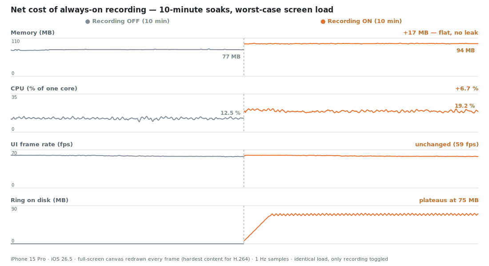

<p align="center">
  <picture>
    <source media="(prefers-color-scheme: dark)" srcset="docs/flashbackkit-logo-dark.png">
    
  </picture>
</p>

<p align="center"><em>Recall the moment <strong>before</strong> the bug.</em></p>

<p align="center">
  
  
  
  
  
</p>

---

A zero-dependency iOS SDK that captures the **context right before a bug happens** — the
last N seconds of screen recording, a one-line note, and full device info — and hands it
off to your pipeline (AI summarizer, Slack, Jira, your own backend) in one callback.

Testers always notice the bug *after* it happens. By then the steps that led there are
gone. FlashbackKit keeps a rolling buffer of the screen, so when a tester files a report,
the seconds **leading up to the bug** are already captured — sparing you the "can you
reproduce it?" round-trips.

> [!NOTE]
> **Status: PoC / WIP.** Built for Debug / Staging / TestFlight / internal QA builds —
> not for shipping to end users. The design bias is making testers *want* to use it and
> improving reproducibility, over architectural purity. The public API may change before
> a 1.0 release.

<details>
<summary>UI preview (design mockups)</summary>

<br>


</details>

## Highlights

- **The "before" is already recorded** — an always-on ReplayKit ring buffer means the
  last N seconds already exist when a report is triggered. ReplayKit can't rewind; this
  is the only way to get the pre-bug context.
- **Zero dependencies** — only system frameworks (UIKit / SwiftUI / ReplayKit), no
  network client of its own. Drops in without touching your dependency graph.
- **Two triggers, your choice** — shake the device twice, or a draggable floating button
  for fixed/kiosk devices.
- **Trim before you send** — testers preview the clip and cut it to the relevant moment;
  the title and device info are baked into the exported file.
- **One handoff point** — a single `onReport` callback delivers the trimmed clip, title,
  and device info. Everything downstream (AI, Slack, Jira, backend) is yours.
- **Unfiltered by design — except passwords** — masking is the host app's job (see
  [Privacy](#privacy--masking-sensitive-data)), but capture pauses automatically while a
  secure text field is being edited.

## How it works

```
 trigger (shake twice / floating button)
        │
        ▼
 export the last N seconds from the ring buffer
        │
        ▼
 Report UI  ──►  preview + trim  +  one-line title  +  auto device info
        │
        ▼
 Share (↑)  ──►  trims, bakes metadata, opens the system share sheet
        │         (save to Photos / Files / AirDrop / other apps)
        ▼
 onReport(FlashbackReport)  ──►  your pipeline (AI / Slack / Jira / backend)
```

## Performance

What does an always-on ring buffer cost? Measured on an iPhone 15 Pro (iOS 26.5): two
10-minute soaks under a **worst-case screen load** (a full-screen canvas redrawn every
frame — the hardest possible content for H.264), identical except recording OFF vs ON.
Thermal state stayed nominal throughout:

<picture>
  <source media="(prefers-color-scheme: dark)" srcset="docs/perf-soak-dark.svg">
  
</picture>

| | Recording OFF | Recording ON | Net cost of the SDK |
|---|---|---|---|
| Memory (median) | 77 MB | 94 MB | **+17 MB — flat over 10 min, no leak** |
| CPU, % of one core (mean) | 12.6 % | 19.3 % | **+6.7 %** |
| UI frames | 58.7 fps, no gaps > 100 ms | 58.6 fps, no gaps > 100 ms | **zero jank** |
| Disk (ring segments) | 0 MB | plateaus at ~75 MB / 9 files | **bounded at the retention window** |

Why it stays this cheap: the ring lives **on disk, not in RAM** — old segments are
deleted as new ones are written, so disk plateaus no matter how long you record (75 MB is
the worst-case-content figure; typical screens compress far smaller). Frame capture runs
in **replayd, out of process**, and ReplayKit only delivers frames **while the screen
changes**, so a static screen costs near zero. And if the encoder ever falls behind,
frames are dropped **from the clip** — the host app is never back-pressured.

Reproduce it on your own device: the Example app's Home tab has a live performance
monitor with a screen-load generator and CSV export — see [Example app](#example-app).

## Installation

Requires **iOS 16+** and **Swift 6 / Xcode 16+**. No dependencies.

**Xcode** — File → Add Package Dependencies… →

```
https://github.com/kensuke242424/flashbackkit-ios.git
```

**Package.swift**:

```swift
.package(url: "https://github.com/kensuke242424/flashbackkit-ios.git", from: "0.12.0")
```

```swift
.target(name: "YourApp", dependencies: ["FlashbackKit"])
```

Latest release: `0.12.0`. Pre-1.0 the public API may still change — pin an exact version
if you need stability.

## Quick Start

Call `Flashback.start()` **once** at app launch — that single line is the whole
integration. It installs the floating button and shake detection (both on by default) and
wires up the record → trim → share flow. Timing doesn't matter: called before your window
scene connects, the overlay installs as soon as the scene is ready.

```swift
import FlashbackKit

Flashback.start()
```

To receive the finished report in your app, pass `onReport`:

```swift
Flashback.start(onReport: { report in
    // report.clipURL  — trimmed clip (temp file); nil when capture wasn't running
    // report.title    — the tester's one-line note
    // report.device   — model / OS / app version / locale …
    myBackend.upload(report)
})
```

> [!IMPORTANT]
> **With the defaults, nothing records and no iOS permission prompt appears at launch.**
> The tester starts recording by tapping the grey floating button (a one-time priming
> sheet, then the iOS prompt). Triggering a report before recording is on shows a
> "recording is off" screen and does **not** fire `onReport`. To buffer from launch, set
> `promptOnLaunch: true`.

From there a tester triggers a report (shake twice / long-press the button), trims the
clip, types a title, and taps **Share (↑)** — the system share sheet opens and your
`onReport` fires. `Flashback.stop()` halts recording and removes the overlay (e.g. when
leaving a QA session or before a sensitive screen).

## Configuration

All fields are optional; defaults shown.

```swift
Flashback.start(
    configuration: .init(
        bufferSeconds: 20,                  // rolling buffer length (also tester-adjustable in-app)
        isEnabled: true,                    // master switch — gate it to no-op in Release builds
        triggers: .default,                 // [.shake, .floatingButton]
        floatingButtonCorner: .bottomTrailing,
        promptOnLaunch: false,              // ask for screen-recording permission at launch
        pausesDuringSecureTextEntry: true,  // pause capture while a password field is edited
        runsOnSimulator: false              // ReplayKit can't record on the Simulator
    )
)
```

> [!NOTE]
> `promptOnLaunch`, `bufferSeconds`, floating-button visibility, and the secure-entry
> guard are also adjustable by the tester in the in-app settings; the in-app choice is
> **persisted and wins over the config default after first launch**. With the default
> `runsOnSimulator: false`, `start()` is a complete no-op on the Simulator — and even
> opted in, recording doesn't work there (test recording on a device).

### Localization

The SDK UI ships in **English and Japanese** (English is the source language). iOS
resolves a package's language against the **host app's declared localizations** — if your
app doesn't declare Japanese, the SDK UI stays English even for Japanese users. To get
Japanese, add `ja` to your app's localizations (Xcode → project → **Info → Localizations
→ +**); no SDK-side configuration is needed.

## The `onReport` handoff

`onReport` is the **only** extension point: FlashbackKit captures, trims, and packages —
then hands you a `FlashbackReport`. Everything downstream is yours to wire up. It's
delivered on the main actor, so do network/disk work inside a `Task`. `clipURL` points to
a **temporary file** — copy or upload it inside the callback if you need to keep it.

```swift
public struct FlashbackReport: Sendable {
    public var title: String      // one-line note typed by the tester
    public var device: DeviceInfo // model, OS, app version, locale, …
    public var clipURL: URL?      // trimmed clip (temp file); nil when capture wasn't running
}
```

```swift
Flashback.start(onReport: { report in
    Task {
        // e.g. summarize with an LLM, then post to Slack with a link to the uploaded clip
        let summary = await llm.summarize(title: report.title, device: report.device)
        let link: String? = if let url = report.clipURL {
            await storage.upload(url)
        } else {
            nil
        }
        await slack.post(text: summary, videoLink: link)
    }
})
```

### Required Info.plist key (only for "Save to Photos")

The share sheet's **Save to Photos** path writes to the camera roll, which needs a usage
description in the **host app's** Info.plist (omitting it crashes on the permission
request). Not needed for "Save to Files":

```xml
<key>NSPhotoLibraryAddUsageDescription</key>
<string>Saves the pre-bug screen clip from your report to your photo library.</string>
```

## Triggers

| Trigger | Best for | Gesture |
|---|---|---|
| `.shake` | handheld testing | shake the device twice (a single jolt won't fire) |
| `.floatingButton` | fixed / kiosk / one-handed | tap = start recording, long-press = open report, drag = move |

The floating button doubles as the recording-state indicator, and its gesture follows
that state:

- **Grey (recording off)** — tap to start recording. The first time, a short priming
  sheet explains the screen-recording permission, then iOS asks.
- **Orange (recording on)** — long-press (0.4 s) to open the report; a short tap shows a
  "long-press to open" hint instead of doing nothing.
- **Drag** to reposition; it snaps to the nearest edge and can tuck away. VoiceOver:
  double-tap activates the state-appropriate action.

When the floating button is turned off, a one-time "shake twice to open" hint tells
testers the shake trigger is still available.

## Privacy & masking sensitive data

Screen recording captures **everything on screen** (customer names, tokens, inventory…).
FlashbackKit deliberately does **not** intercept the recording pipeline — masking is the
host app's responsibility, because only the host knows what's sensitive.

- **Password entry pauses recording automatically.** iOS's secure-field blanking protects
  *external* captures only — the SDK's in-app capture would record the masked dots, the
  per-keystroke preview, and revealed text (measured on device). So capture pauses while
  a secure text field (`isSecureTextEntry`, including SwiftUI's `SecureField`) is being
  edited, and quietly resumes with a fresh buffer when editing ends. Opt out via
  `pausesDuringSecureTextEntry: false`. Not covered: a password *revealed* via an eye
  toggle — stop recording around such screens instead.
- **Everything else is up to you** — use dummy data in QA builds, or call
  `Flashback.stop()` before a sensitive screen. (The known "secure-layer trick" hides
  views from **OS** captures only; the SDK's own in-app clip still records them.)
- **The share destination is the tester's choice** — saving to Photos may sync the clip
  to iCloud; keep that in mind for sensitive content.

Found a security issue (e.g. a clip leak)? Please report it **privately** via GitHub's
["Report a vulnerability"](https://github.com/kensuke242424/flashbackkit-ios/security/advisories/new)
flow rather than filing a public issue.

## Known constraints

Platform realities the design works *around*, not bugs:

- **ReplayKit can't record retroactively** → an always-on ring buffer is the only way to
  have the "before" — hence the permission prompt and the costs measured in
  [Performance](#performance).
- **Rotation restarts the capture session** → ReplayKit freezes the buffer dimensions at
  capture start, and on most devices a later rotation changes nothing it reports (the
  upright UI just gets squeezed into the frozen buffer). On a detected rotation the SDK
  restarts the session: a sub-second gap, the pre-rotation buffer is discarded, and each
  clip comes out upright at its orientation's native resolution.
- **In-app capture isn't covered by iOS's secure-field blanking** → the SDK pauses
  capture during secure text entry instead (see
  [Privacy](#privacy--masking-sensitive-data)).
- **Slack Incoming Webhooks can't send video** → post text plus a link, or upload with a
  Bot token (`files.getUploadURLExternal` / `completeUploadExternal`).
- **Claude / OpenAI can't analyze video directly** → extract keyframes, or use a
  video-native model.

## Example app

`Example/FlashbackExample.xcodeproj` is a host app that exercises the full loop.

- **Performance monitor** — the Home tab card opens live memory / CPU / ring-disk /
  frame-pacing charts with a screen-load generator and CSV export (the numbers in
  [Performance](#performance) were captured with it).
- **Simulator** — builds as-is (no signing). Recording doesn't work on the Simulator, so
  the Example opts in via `runsOnSimulator: true` just to show the UI; your own app, with
  the default `false`, will show nothing there.
- **Device** — needs code signing. Team IDs aren't committed, so set yours:

  ```sh
  cp Example/Signing.example.xcconfig Example/Signing.xcconfig
  # edit Signing.xcconfig → set DEVELOPMENT_TEAM to your Apple Developer Team ID
  ```

In `DEBUG` builds, `Flashback` also exposes helpers that present each UI state directly —
`debugPresentSampleReport()`, `debugPresentSettings()`, `debugPresentPriming()`, and
friends — handy on the Simulator and for re-testing first-run flows (they require
`Flashback.start()` to have installed the overlay).

## Contributing

Issues and PRs are welcome — for recording behavior, please note whether you saw it on a
device or the Simulator. Keep the **zero-dependency** rule (no third-party packages),
give `public` API doc comments, and mark types touching UI / recording / shake detection
`@MainActor`. Build & test commands and guidelines:
[CONTRIBUTING.md](CONTRIBUTING.md) · release history: [CHANGELOG.md](CHANGELOG.md).

## License

[MIT](LICENSE)
